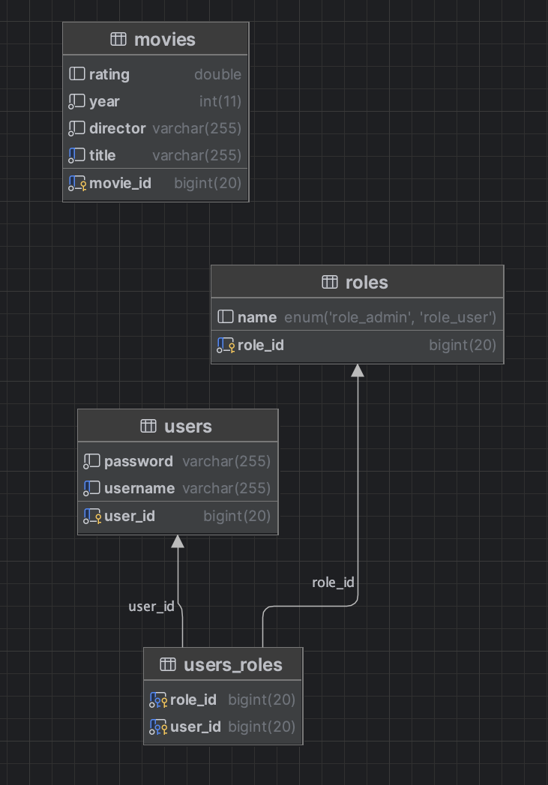

# Movie Library REST API

## Overview

Movie Library is a REST-based application that exposes endpoints for creating, retrieving, updating, and deleting movies.
When a movie is created, the application asynchronously queries the OMDb API to fetch and populate the official IMDb rating without blocking the request.

The application implements role-based access control, JWT-based authentication, and full User / Movie CRUD operations.

## Features

**User Management**

- User registration and authentication
- Role-based authorization (ADMIN / USER)

**Movie Management**

- Create, retrieve, update, and delete movies
- Asynchronous IMDb rating enrichment via OMDb API
- Validation of input data

**Security**

- Spring Security with JWT authentication
- Stateless API (no server-side sessions)
- Method-level authorization (@PreAuthorize)
- Password Hashing using BCrypt

**Authorization rules**

- *USER* -> Read-only access to movie data, creating and updating personal user information only
- *ADMIN* -> Full CRUD access to movies and users

## Tech Stack

- Java 17+
- Spring Boot
- Spring Web
- Spring Security
- Spring Data JPA / Hibernate
- MariaDB
- JWT (JSON Web Token)
- Swagger / OpenAPI

## Installation

**Prerequisites**
- Java 17+
- MariaDB installed and running

Follow these steps to set up and run the application:

- First, download the project using git clone, or through GitHub's interface under Code -> Download ZIP

```bash
    git clone https://github.com/ivelinyanev/movie-library
```

- Then create your own application-secrets.properties file inside /src/main/resources, which should include a JWT secret (you can use mine or get one here https://jwtgenerator.com/tools/jwt-generator) and OMDb API key. To get your OMDb API key, please visit https://www.omdbapi.com/apikey.aspx. It is free of charge with a daily limit of 1000 requests.

```bash
    jwt.secret=4T0uxUYUb6ca477SsCumzU8JkQ37t9XBOLsgGwbpC6-DrZsyr7HO9EtNg5y3CZdxu9nGFqYR9qSGOUh6muVtJA
    omdb.api.key={{your_api_key}}
```

- You can also make use of the create.sql for the database schema and the insert.sql for an initial insert. Both .sql files you can find inside the db folder

- Then run the backend from the IDE of your choice. You can test the API via Postman, cURL, or Swagger UI.

## Swagger Documentation

Swagger UI is available once the application is running:
- http://localhost:8080/swagger-ui/index.html
- All endpoints and request/response models are documented

## Database Diagram



## Contributors
For further information, please feel free to contact me:

| Authors              | Emails    | GitHub|
| ------               | ------    |------ |
| Ivelin Yanev         | ivelinyanev00@gmail.com     | https://github.com/ivelinyanev  |
